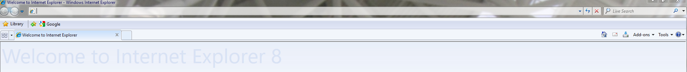

# What is RinFox?
 

Rinfox is a Mozilla Firefox 115ESR theme that mimicks the look and feel of Internet Explorer 7 (and 8). Rinfox is named after "Rincon" (IE7's codename) and is made by [travis](https://github.com/travy-patty) which also made [Windows eXPerience](https://experience.noncities.com/). This is a simple GitHub repo of his 0.4.1 version of it, for simple and easy reach, and if people want to fix it (as a lot of things are semi-broken).

## Features

* Customized toolbar with accurate icons and layout.
* Search bar and dropdown with accurate orange color.
* Full support for Aero and Aero-enabled msstyles themes.
* inPrivate logo when enabling private browsing.
* Custom pages for Home Page, New Tab and inPrivate Browsing.
* Customized TipTab extension to look like QuickTabs.
* Customized branding and aboutBox (when viewing About Firefox).
* Internet Explorer 7/8 icons.
* Toggle-able switch between Internet Explorer 7 and Internet Explorer 8 look.
* Compatible with Firefox 115ESR.
* *Can optionally be tweaked to work on Waterfox and floorp.*

###### Internet Explorer 7 (default) mode with applied icons, correct layout, aero and IE7 style omni.ja tweaks:

###### Internet Explorer 8 mode with applied icons, correct layout, aero and IE8 style omni.ja tweaks:

## Installation

###### This theme is compatible with 115ESR and it's advised to use it. ESR receives security updates longer than normal versions of Firefox and has less theme-breaking updates. Starting with Firefox 117, Mozilla has stopped supporting Windows 7 thus removing the possibility to use Aero themes for it.

1. Download and install Firefox 115ESR:
   * https://ftp.mozilla.org/pub/firefox/releases/115.3.1esr/win64/en-US/
2. Once up and running, go to About Firefox and let it update to latest security update.
3. Now that Firefox is updated, we can start applying the theme. In Firefox, type about:config and search and edit the following values accordingly:

> toolkit.legacyUserProfileCustomizations.stylesheets
>> set to: TRUE

> browser.theme.dark-private-windows
>> set to: FALSE

> browser.display.windows.non_native_menus
>> set value as: 0

> ui.prefersReducedMotion
>> create, if missing, as NUMBER, then set value as: 1

> browser.privateWindowSeparation.enabled
>> set to: FALSE

> browser.tabs.secondaryTextUnsupportedLocales
>> add your locale such as: en

> xpinstall.signatures.required
>> set to: FALSE //// **This disables extension signature, which may be a security risk**. This can be skipped if you don't want to skin TipTab extension to look like QuickTabs when pressed (icon will still be skinned regardless).

###### Thanks to a new update, now you can choose between Translations. Pick whichever you like and make sure to start copying only the folders as instructed below.
4. Go to the installation folder of Firefox (usually inside C:\Program Files\Mozilla Firefox) and copy the **contents** of ffroot folder from rinfox folder inside it, and replace when prompted the files.
5. In Firefox, type about:support. Scroll down till you see Profile Folder tab then click Open Folder. Copy the entire "chrome" folder from rinfox folder inside it. Also in about:support select "Clear Startup Cache".
6. Close and reopen Firefox.
7. Now you should see that the layout has been applied, albeit it looks not right. To fix it right click on the tabs toolbar and press "Customize Toolbar".
  * If you don't have already (enabled by default) set auto theme by going to about:addons > Themes > Enable Auto theme.
9. Inside Customize toolbar, at the bottom check Title Bar, and remove everything removable from the toolbar by doing Right-Click on element and hitting Remove from toolbar. Now slowly add the elements copying the following layout:

   * Note that menu bar is hidden, and that you need to uncheck Hide downloads.
10. To have the Quick Tabs, if you have skipped *xpinstall.signatures.required* [you may simply install TipTab from Firefox Extensions store](https://addons.mozilla.org/en-US/firefox/addon/tip-tab/). This will not be skinned when activated but it will still have the icon skinned in toolbar. Simply install it, pin it to toolbar, go back again to Customize Toolbar and add it after the star with plus icon (Library). It should be auto-skinned (icon only).
   * To go extra mile with skinned look when pressed and you have *xpinstall.signatures.required* disabled, go to about:addons and click on the little wheel and do Install Add-on From File and select the xpi extension from Quick Tabs Extension folder. Simply install it, pin it to toolbar, go back again to Customize Toolbar and add it after the star with plus icon (Library). It should be auto-skinned.
11. Now its a good idea to disable updates to Firefox. While updating ESR **should** not break things, it will always break omni.ja tweaks (homepage, inprivate page and new page) as well as icons (Firefox icon) will be reverted, if that isnt a big deal for you, simply skip this step. If you want to disable them, you can do so by following the following guide:
  * https://www.askvg.com/tip-disable-automatic-updates-in-mozilla-firefox/#how_to_disable_automatic_updates_in_mozilla_firefox

## Switching between Internet Explorer 7 and Internet Explorer 8 mode

1. By switching modes, changes such as About Firefox box, and layout change will happen.
2. To do so, open Firefox and type about:config and add the following value as so:

> rinfox.tweak.ie8
>> create as BOOLEAN, then set value to: TRUE

3. Restart Firefox. Now you should see that the layout has been switched, albeit it looks not right. To fix it right click on the tabs toolbar and press "Customize Toolbar".
4. Inside Customize toolbar, add back the Bookmarks tab and change the layout like so:

* Note that you add Library, Bookmarks **AND a seperator** (in Configuration Toolbar: the one in the middle - straight vertical line) after it. Don't worry it's not like in the picture, it will auto-adjust itself.
5. Hit Done. If layout looks weird (icons look too big), a restart of your PC is needed. When back from the restart, it should be auto-fixed.

## Extras

* The extras part is optional, however it does make it more convincing overall. Extras contain replacing HomePage, New Tab page and inPrivate page (omni.ja tweaks), and lets you replace the Firefox icon system-wide as well as enabling Aero for themes that support it.
* **This part is recommended to be used with disabled updates, as they WILL get overwritten when a new ESR update is installed.**

### Replacing Firefox icons and enabling Aero

1. Download and install Resource Hacker:
  * http://www.angusj.com/resourcehacker/
2. Open Resource Hacker and load firefox.exe from Firefox installation folder (usually inside C:\Program Files\Mozilla Firefox).
3. Edit the following values accordingly:

> Inside String Table tab
>> Simply change "Firefox" to "Internet Explorer" then hit compile (green play button).

> Inside Icon Group tab
>> Go to IconGroup 1, 2, 5, 6 & 32512, do right click and hit Change Resource and replace each to the .icos inside "icons" folder accordingly

> Inside Manifest tab
>> Simply remove all but last supportedID (should only be supportedOS Id="{35138b9a-5d96-4fbd-8e2d-a2440225f93a}"/>), then hit compile (green play button).

4. Do File > Save and save it as firefox.exe on Desktop. Do Ctrl+C and Ctrl+V and replace firefox.exe from the installation folder.

### Omni.ja tweaks

###### Thanks to a new update, now you can choose between Translations and style of pages (Internet Explorer 7 style or Internet Explorer 8 style). Pick whichever you like and make sure to start copying only the "chrome" folder as instructed below.
1. Go to Firefox installation folder > **browser folder** (usually inside C:\Program Files\Mozilla Firefox\browser). There you should find a file called omni.ja. Simply open it with WinRar or 7Zip and extract it somewhere on your Desktop.
2. Copy and replace "chrome" folder inside the extracted files.
3. Take all folders and zip it back(do not create have extra folders). Change extension from .zip to .ja.
4. Copy and replace omni.ja. Final omni.ja should look like this (note the contents and location of archive):
 
6. Open Firefox, navigate to Settings > Home and change inside New Windows and Tabs:
  * Homepage and new windows > Firefox Home (Default)
  * New tabs > Blank Page
6. Back to Settings > Privacy & Security > Clear Data. Check only Cookies and Site Data then hit Clear.
7. Back to Settings > Privacy & Security > History (scroll down). In the drop-down menu next to Firefox will, choose Use custom settings for history. Turn on Clear history when Firefox closes and hit Settings button. Inside settings dialog, uncheck everything besides Cache (only Cache should be checked). Hit OK.
8. Finally, go to Firefox installation folder, and right click firefox.exe > Send to > Desktop (create shortcut).
9. Go to the shortcut, right-click to it > Properties > Shorcut, and in Target, change it to:
  * "C:\Program Files\Mozilla Firefox\firefox.exe" --purgecaches --purgecache
10. Hit Apply, OK. You should open Firefox from this shorcut, so pin it to taskbar or send it to Start Menu.

## Credits

### Rinfox Development
* Rinfox is made by [travis](https://github.com/travy-patty) which also made [Windows eXPerience](https://experience.noncities.com/).
* About dialog fixes, inPrivate svg and addition to toolbar by [angelbruni](https://github.com/brunobits).
* Accurate single tab size addition & removal of X button for one tab by RandomFIFA64#7391
* IE8 Bookmarks fix by [ImSwordQueen](https://github.com/ImSwordQueen)
* omni.ja tweaks by me.
* [Tip Tab by William Wong](https://addons.mozilla.org/en-US/firefox/addon/tip-tab/)
* Mozilla for Firefox.
* Microsoft for IE7 icons.

### Translations
* English - me (florin)
* Romanian - me (florin)
* Spanish - [luisl173](https://github.com/florinsdistortedvision/rinfox_updated/pull/1)
